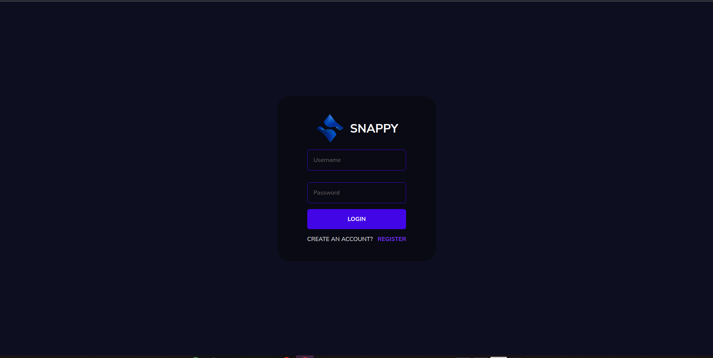
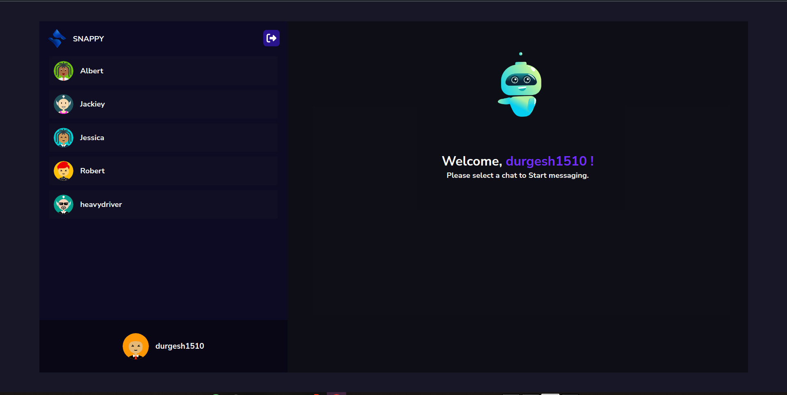
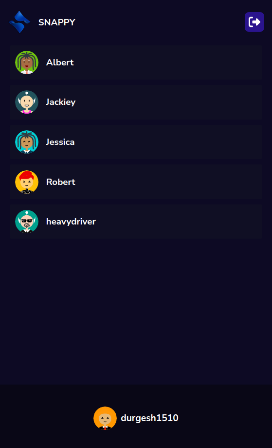
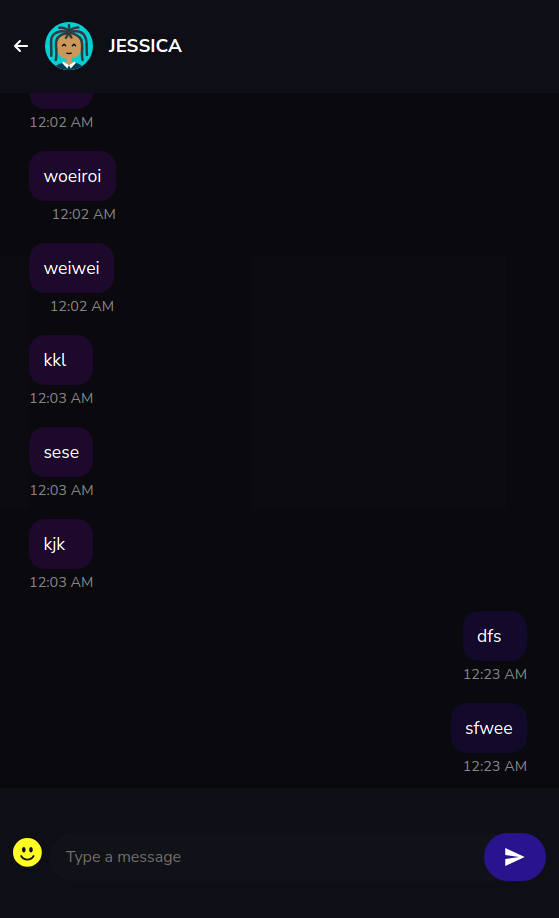

# Snappy - Chat Application 
Snappy is chat application build with the power of MERN Stack & Socket io. You can do realtime chat with friends with stunning UI website.
### Live link: [here](https://chat-app-2893.onrender.com/)






### On Mobile Screen display
<!--   -->

 


## Installation Guide

### Requirements
- [Nodejs](https://nodejs.org/en/download)
- [Mongodb](https://www.mongodb.com/docs/manual/administration/install-community/)

Both should be installed and make sure mongodb is running.

```shell
git clone https://github.com/durgeshmehar/Live-Chat-Website.git
cd Live-Chat-Website.git
```

Now install the dependencies
```shell
npm install
```
Now for Building the frontend
 ```shell
npm run build
```
We are almost done, Now just start the development server.

```shell
npm run dev
```

Done! Now open localhost:3000 in your browser.
